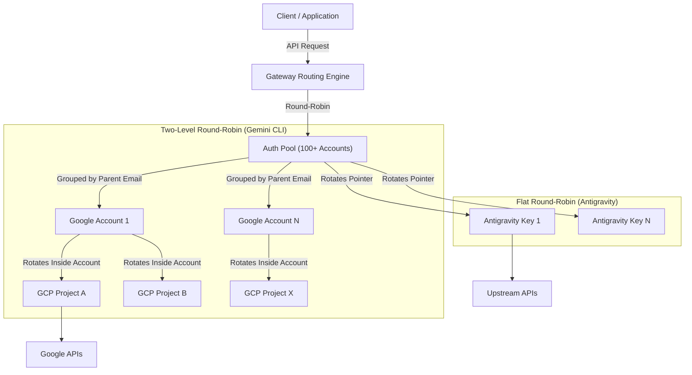

# AIAPIGiaRe Gateway

English | [中文](README_CN.md) | [日本語](README_JA.md)

An enterprise-grade proxy server that provides OpenAI/Gemini/Claude/Codex compatible API interfaces.

AIAPIGiaRe supports high-concurrency environments with OpenAI Codex (GPT models) and Claude Code via OAuth, designed for industrial-scale deployment.

It provides local or multi-account CLI access with OpenAI(include Responses)/Gemini/Claude-compatible clients and SDKs.

## Model Alias Fallback (Depth 2 Cascading)

AIAPIGiaRe implements an advanced fallback pool. When you alias multiple models to a single upstream target (e.g. `claude-opus-4-7`), the gateway automatically constructs a high-availability fallback pool. If the primary edge model becomes rate-limited, the gateway instantly and seamlessly routes traffic to the backup standard model.

```mermaid
flowchart TD
    Request["Incoming Request (claude-opus-4-7)"] --> Router{"Model Alias Router"}
    
    Router -->|Primary Candidate| Primary["gemini-3.1-flash-lite-preview"]
    Router -->|Secondary Candidate| Backup["gemini-3-flash"]
    
    Primary --> CheckPrimary{"Is Primary Rate-Limited?"}
    
    CheckPrimary -->|No| ExecutePrimary["Execute Inference (Primary)"]
    CheckPrimary -->|Yes (429 Quota Exceeded)| Fallback["Failover to Backup Engine"]
    
    Fallback --> Backup
    Backup --> ExecuteBackup["Execute Inference (Backup)"]
```

## Gateway Architecture

The gateway utilizes an advanced **Two-Level Round-Robin** algorithm designed for enterprise scale. It perfectly mathematically balances traffic across hundreds of connected Google Accounts and API keys without burning out specific quotas.



## Overview

- OpenAI/Gemini/Claude compatible API endpoints for CLI models
- OpenAI Codex support (GPT models) via OAuth login
- Claude Code support via OAuth login
- Amp CLI and IDE extensions support with provider routing
- Streaming and non-streaming responses
- Function calling/tools support
- Multimodal input support (text and images)
- Multiple accounts with round-robin load balancing (Gemini, OpenAI, Claude)
- Simple CLI authentication flows (Gemini, OpenAI, Claude)
- Generative Language API Key support
- AI Studio Build multi-account load balancing
- Gemini CLI multi-account load balancing
- Claude Code multi-account load balancing
- OpenAI Codex multi-account load balancing
- OpenAI-compatible upstream providers via config (e.g., OpenRouter)
- Reusable Go SDK for embedding the proxy (see `docs/sdk-usage.md`)
